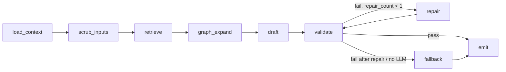
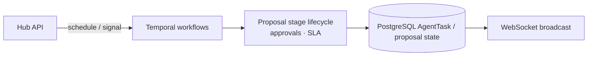

# AI Pipeline Architecture — Presales Hub

> Canonical decisions: [`docs/DECISIONS.md`](../DECISIONS.md) (esp. D-004, D-006, D-014).  
> Motivation (DLP / public-AI distrust): [`PURPOSE.md`](../../PURPOSE.md).

## Drafting graph (D-014 / G1) — LangGraph, draft-only

War-room Generate (`.docx`), copilot draft-section, and `agent_engine` proposal_drafting share one LangGraph in `copilot_engine/graphs/draft_graph.py`.

**Not** a Temporal replacement: Temporal remains the durable proposal **lifecycle** control plane (D-006). Session 4 UI redesign is deferred.



| Node | Role |
|------|------|
| `load_context` | Load proposal + opportunity metadata |
| `scrub_inputs` | Scrub user brief/query before any remote call |
| `retrieve` | RAG over scrubbed chunks (`MemoryRetriever` / pgvector) |
| `graph_expand` | Optional neighbourhood expand on retrieved set |
| `draft` | Groq on **scrubbed** brief + scrubbed retrieved context; if no `GROQ_API_KEY`, template from chunks |
| `validate` | Grounding hard gate (citations / fabrication checks) |
| `repair` | One repair loop max, then fallback |
| `fallback` | Retrieval-grounded `template_fallback` (no raw ungrounded Groq emit) |
| `emit` | Structured draft / section map for docx or UI |

**Observability:** Langfuse node spans + grounding scores (not LangGraph Studio as the source of truth).

## Chat vs embeddings (D-004)

| Concern | Stack |
|---------|--------|
| Chat / Generate | **Groq** cloud API on **scrubbed** text + scrubbed retrieved chunks only |
| Embeddings | Local `sentence-transformers/all-MiniLM-L6-v2` (**384** dims, CPU) |
| Fallback | Template `.docx` / sections from retrieved scrubbed chunks if Groq unavailable or grounding fails |
| Secrets | `GROQ_API_KEY` via env only (never commit `.env` or keys) |

Circuit breakers still wrap external provider + Temporal client calls for non-draft paths; drafting prefers Groq-or-template as above.

## RAG / memory (pgvector)

```mermaid
flowchart LR
    Doc[Scrubbed source\nRFP / proposal / pack] -->|chunk| Embed
    Embed[all-MiniLM-L6-v2\n384-d] -->|dual-write| VS[(PostgreSQL pgvector\nembedding vector(384)\n+ embedding_json)]
    Query[Scrubbed query] --> QEmbed[Query embed]
    QEmbed -->|cosine ANN| VS
    VS -->|top-k| Prompt[Draft graph context]
```

- **Column:** `memory_chunks.embedding vector(384)` (+ `embedding_json` for SQLite/tests).
- **Dual-write (intended):** upsert keeps JSON and writes the native vector column when the schema is present.
- **Fail-closed on search:** when `USE_PGVECTOR` is true, missing extension/column must not silently degrade ANN search to app-side JSON cosine — migrate (`alembic upgrade head` on a pgvector image) instead.
- Upsert dual-write hardening may land in parallel on the reliability branch; end state is dual-write + fail-closed search as above.
- Never index or commit **raw** proposals — see [`docs/CORPUS.md`](../CORPUS.md).

## Temporal — lifecycle only



Agents such as rfp_analyzer / SME recommenders may still run as Temporal activities; **proposal text drafting** goes through the LangGraph above, not Temporal-as-writer.

## Timeouts (Generate)

| Path | Timeout |
|------|---------|
| Default HTTP | 30s (`RequestTimeoutMiddleware`) |
| Copilot / `/api/ai/generate` prefixes | 120s (middleware prefix overrides) |
| `POST /api/ai/proposals/{id}/generate-docx` | **180s** via per-route `TimeoutAPIRoute` + `@with_timeout(180)` — middleware skips its outer wait when the route owns the deadline |
| WebSocket | 0 (no middleware timeout) |

## AI governance & quotas

Quota checks (`TenantQuota`), usage logging, and the governance dashboard remain as implemented for AI request metering — orthogonal to the draft graph topology.
