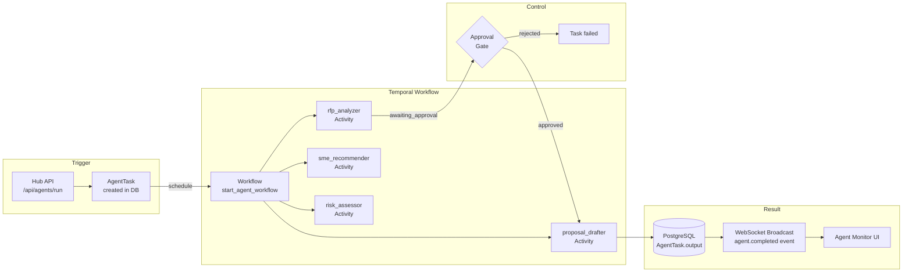
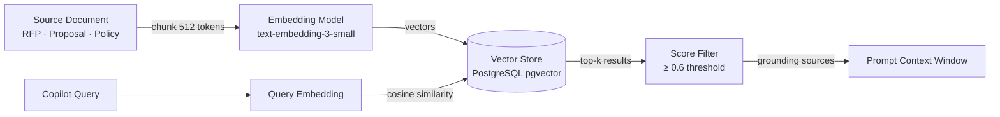
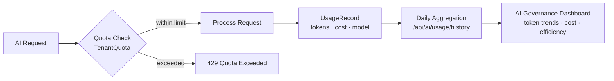

# AI Pipeline Architecture — Presales Hub

## End-to-End AI Request Flow

```mermaid
flowchart TB
    subgraph Input
        User[Presales Lead] -->|RFP document\nor query| Copilot
    end

    subgraph Copilot["AI Copilot Layer"]
        Copilot[/copilot/assist] --> RAG
        RAG[Memory / RAG Engine\n/memory/search] -->|top-k chunks\nscore ≥ 0.6| Prompt
        Prompt[Prompt Builder\ncontext injection\nrole instructions] --> CB
    end

    subgraph Provider["Provider Layer (Circuit Breaker)"]
        CB{Circuit\nBreaker} -->|CLOSED| ANT[Anthropic Claude\nclaude-sonnet-4-5]
        CB -->|fallback| OAI[OpenAI GPT-4o]
        CB -->|fallback| GRQ[Groq LLaMA]
        CB -->|OPEN| ERR[503 Degraded\nGraceful fallback message]
    end

    subgraph Safety["Safety & Evaluation"]
        ANT --> Eval[Evaluation Layer\nsafety_flags check\ngrounding score ≥ 0.7]
        OAI --> Eval
        Eval -->|pass| Response
        Eval -->|flag| Review[Human Review Queue]
    end

    subgraph Output
        Response[Structured Response\nresult + grounding_metadata\nevaluation_score + safety_flags]
        Response --> FE[Frontend\nConfidenceBar\nGroundingCitations\nReasoningTrace]
    end
```

## Agent Orchestration



## RAG / Memory Pipeline



## AI Governance & Quotas


