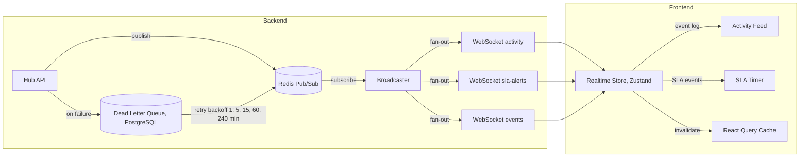
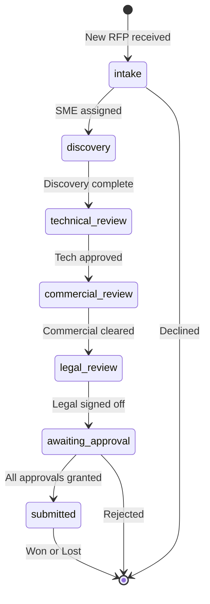
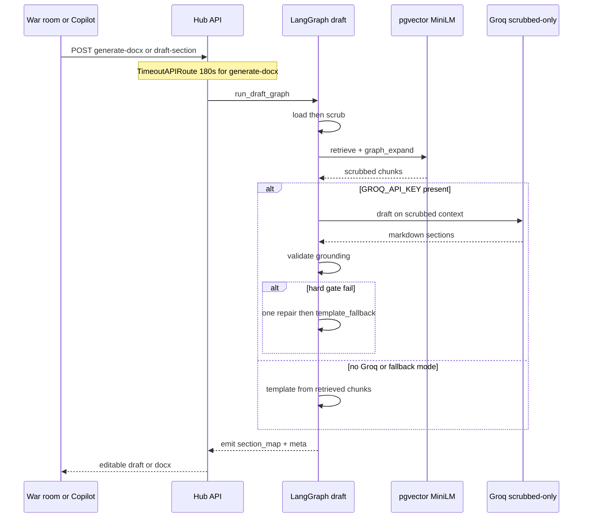
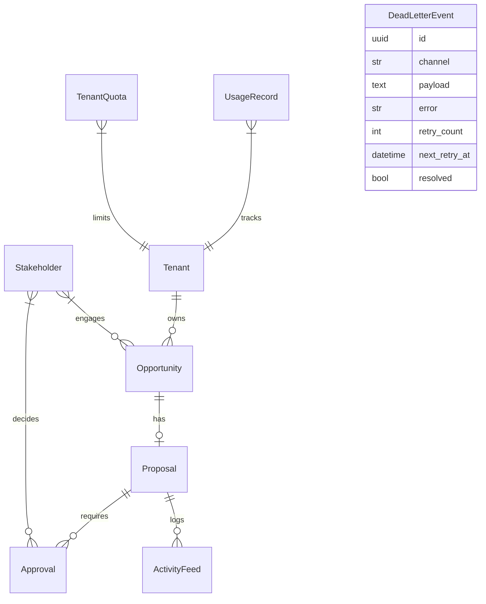

# Data Flow — Presales Hub

## Real-time event bus

## Proposal lifecycle (Temporal)

Durable stage transitions and approvals run on Temporal. **Draft text** is produced by the LangGraph draft graph (see [`ai-pipeline.md`](./ai-pipeline.md)), not by Temporal-as-writer.

## AI draft request flow (war-room Generate)

## Database schema (core)

Vectors live in the same Postgres DB (`memory_chunks.embedding vector(384)` + `embedding_json`); see [`ai-pipeline.md`](./ai-pipeline.md) and [`docs/CORPUS.md`](../CORPUS.md).
