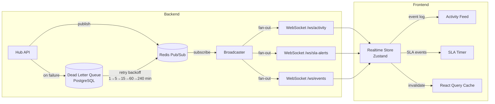
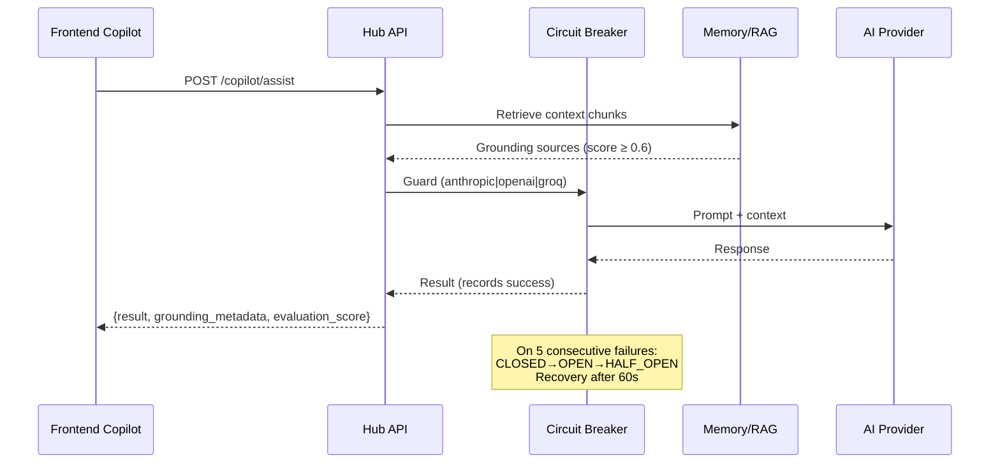
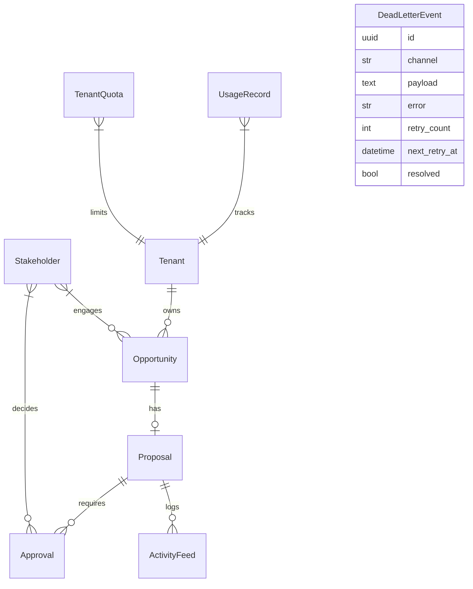

# Data Flow — Presales Hub

## Real-Time Event Bus

```mermaid
flowchart LR
    subgraph Backend
        API[Hub API] -->|publish| RD[(Redis Pub/Sub)]
        API -->|on failure| DLQ[(Dead Letter Queue\nPostgreSQL)]
        DLQ -->|retry backoff\n1→5→15→60→240 min| RD
        RD -->|subscribe| BR[Broadcaster]
        BR -->|fan-out| WS1[WebSocket /ws/activity]
        BR -->|fan-out| WS2[WebSocket /ws/sla-alerts]
        BR -->|fan-out| WS3[WebSocket /ws/events]
    end

    subgraph Frontend
        WS1 --> RST[Realtime Store\nZustand]
        WS2 --> RST
        WS3 --> RST
        RST -->|event log| AF[Activity Feed]
        RST -->|SLA events| SLA[SLA Timer]
        RST -->|invalidate| RQ[React Query Cache]
    end
```

## Proposal Lifecycle

```mermaid
stateDiagram-v2
    [*] --> intake: New RFP received
    intake --> discovery: SME assigned
    discovery --> technical_review: Discovery complete
    technical_review --> commercial_review: Tech approved
    commercial_review --> legal_review: Commercial cleared
    legal_review --> awaiting_approval: Legal signed off
    awaiting_approval --> submitted: All approvals granted
    submitted --> [*]: Won / Lost

    intake --> [*]: Declined
    awaiting_approval --> [*]: Rejected
```

## AI Request Flow

```mermaid
sequenceDiagram
    participant FE as Frontend Copilot
    participant API as Hub API
    participant CB as Circuit Breaker
    participant RAG as Memory/RAG
    participant AI as AI Provider

    FE->>API: POST /copilot/assist
    API->>RAG: Retrieve context chunks
    RAG-->>API: Grounding sources (score ≥ 0.6)
    API->>CB: Guard (anthropic|openai|groq)
    CB->>AI: Prompt + context
    AI-->>CB: Response
    CB-->>API: Result (records success)
    API-->>FE: {result, grounding_metadata, evaluation_score}

    note over CB: On 5 consecutive failures:<br/>CLOSED→OPEN→HALF_OPEN<br/>Recovery after 60s
```

## Database Schema (Core)

```mermaid
erDiagram
    Tenant ||--o{ Opportunity : owns
    Opportunity ||--o| Proposal : has
    Proposal ||--o{ Approval : requires
    Proposal ||--o{ ActivityFeed : logs
    Stakeholder }|--o{ Approval : decides
    Stakeholder }|--o{ Opportunity : engages

    UsageRecord }|--|| Tenant : tracks
    TenantQuota }|--|| Tenant : limits
    DeadLetterEvent {
        uuid id
        str channel
        text payload
        str error
        int retry_count
        datetime next_retry_at
        bool resolved
    }
```
