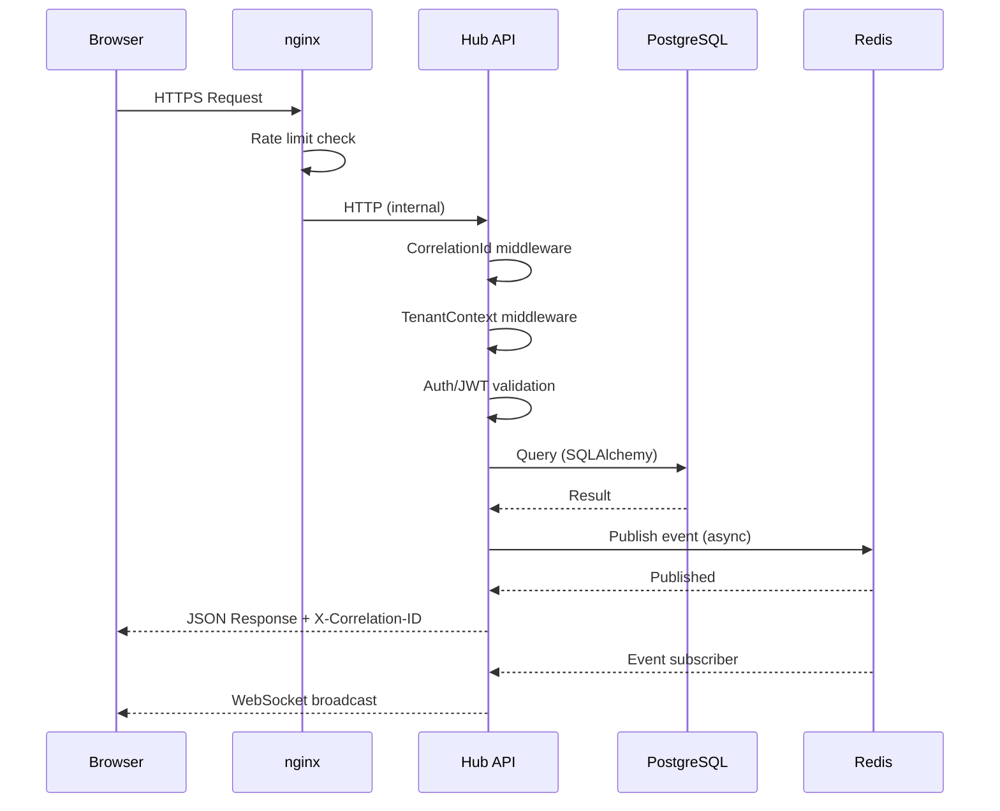
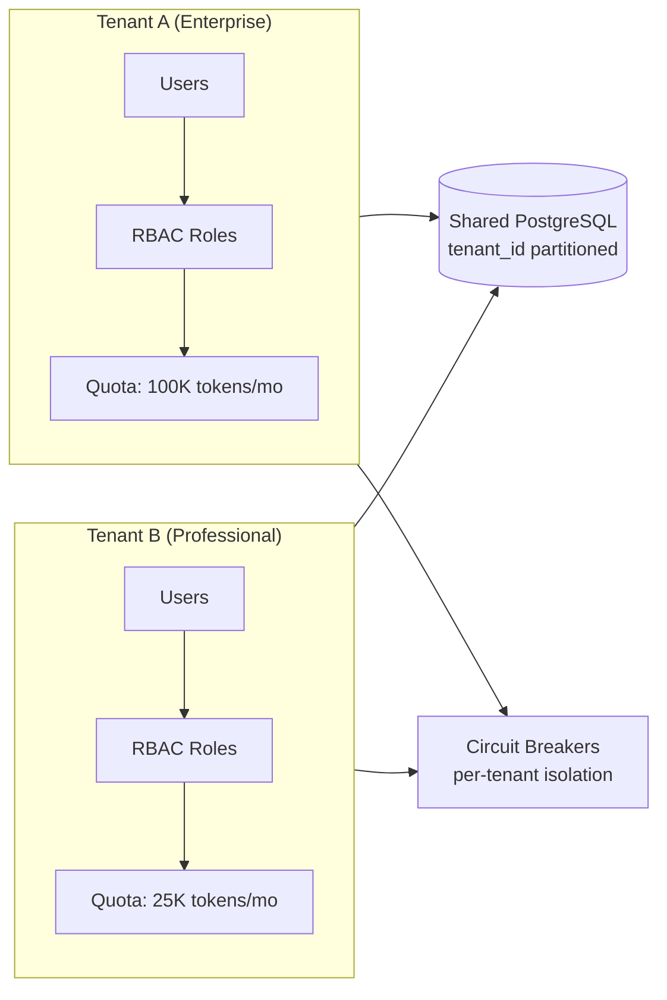

# System Architecture — Presales Hub

> Enterprise AI-Native Presales Operating System

## Full System Topology

```mermaid
graph TB
    subgraph Browser["Browser (Next.js 15 · React 19)"]
        UI[Dashboard UI]
        WS_C[WebSocket Client]
        CP[Command Palette]
        EW[Executive Wallboard]
    end

    subgraph nginx["nginx Reverse Proxy"]
        RL[Rate Limiting<br/>100 req/min API<br/>20 req/min auth]
        SSL[TLS Termination<br/>TLS 1.2/1.3]
        WS_P[WebSocket Proxy<br/>/ws/* upgrade]
    end

    subgraph API["Hub API (FastAPI :8003)"]
        MW[Middleware Chain<br/>CorrelationId → TenantContext<br/>Timeout → SizeLimit<br/>SecurityHeaders → CORS]
        AUTH[Auth & RBAC<br/>JWT · Lockout · slowapi]
        ROUTERS[14 Routers<br/>proposals · approvals · sla<br/>analytics · ai · copilot<br/>agents · workflows · memory<br/>platform · ai_governance]
        HEALTH[/api/health<br/>/api/ready<br/>/metrics]
        WS_H[WebSocket Handlers<br/>/ws/activity<br/>/ws/sla-alerts<br/>/ws/events]
    end

    subgraph Worker["Temporal Worker (:8004)"]
        WK[Workflow Activities<br/>proposal lifecycle<br/>SLA enforcement<br/>AI orchestration]
        WH[Health Endpoint<br/>:8004/health]
    end

    subgraph Data["Data Layer"]
        PG[(PostgreSQL :5432<br/>Primary store<br/>Alembic migrations)]
        RD[(Redis :6379<br/>Pub/Sub event bus<br/>Rate limit counters)]
        TMP[Temporal :7233<br/>Workflow state<br/>Activity scheduling]
    end

    subgraph AI["AI Providers"]
        ANT[Anthropic Claude<br/>Circuit breaker: 5 fail/60s]
        OAI[OpenAI<br/>Circuit breaker: 5 fail/60s]
        GRQ[Groq<br/>Circuit breaker: 5 fail/30s]
    end

    subgraph Obs["Observability"]
        PROM[Prometheus<br/>/metrics]
        JAEGER[Jaeger<br/>:16686]
        SENTRY[Sentry<br/>Error tracking]
    end

    Browser <-->|HTTPS/WSS| nginx
    nginx <-->|HTTP/WS| API
    API <-->|SQLAlchemy| PG
    API <-->|redis-py| RD
    API <-->|gRPC| TMP
    API -->|OTLP traces| JAEGER
    API -->|scrape| PROM
    API -->|errors| SENTRY
    Worker <-->|gRPC| TMP
    Worker <-->|SQLAlchemy| PG
    ROUTERS -->|circuit breaker| AI
    RD -->|pub/sub| WS_H
    WS_H -->|broadcast| WS_C
```

## Request Flow



## Multi-Tenant Isolation



## Key Numbers

| Metric | Value |
|--------|-------|
| API port | 8003 |
| Worker health port | 8004 |
| Temporal port | 7233 |
| Redis port | 6379 |
| PostgreSQL port | 5432 |
| Request timeout (default) | 30s |
| AI endpoint timeout | 120s |
| Max request body | 10 MB |
| Rate limit (login) | 20/min |
| Account lockout | 5 fails → 15 min |
| Circuit breaker recovery | 60s (AI), 30s (Temporal) |
| DLQ retry backoff | 1, 5, 15, 60, 240 min |
