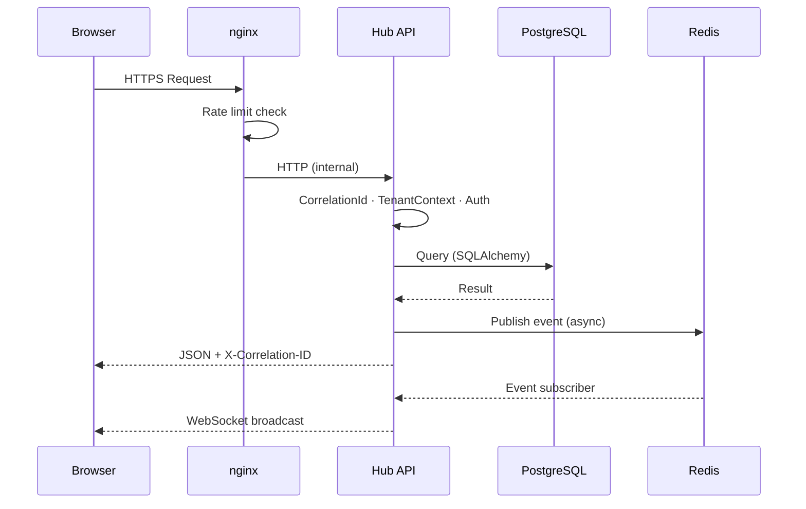
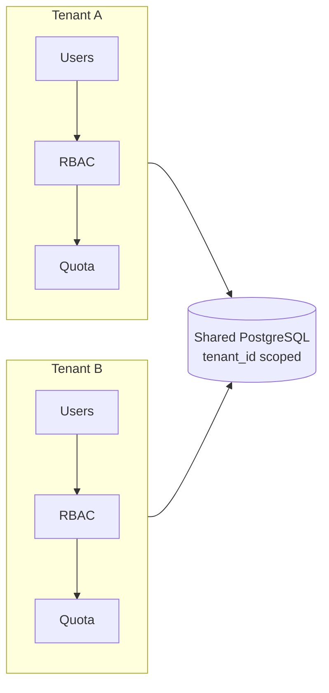

# System Architecture — Presales Hub

> Enterprise-style local stack for an AI-native presales operating console.  
> Intent: [`PURPOSE.md`](../../PURPOSE.md) · Decisions: [`docs/DECISIONS.md`](../DECISIONS.md) · Draft AI: [`ai-pipeline.md`](./ai-pipeline.md)

## Full system topology

```mermaid
graph TB
    subgraph Browser["Browser (Next.js · React)"]
        UI[Dashboard UI]
        WS_C[WebSocket Client]
        CP[Command Palette]
        EW[Executive Wallboard]
    end

    subgraph nginx["nginx Reverse Proxy"]
        RL[Rate Limiting<br/>100 req/min API<br/>20 req/min auth]
        SSL[TLS Termination]
        WS_P[WebSocket Proxy<br/>/ws/* upgrade]
    end

    subgraph API["Hub API (FastAPI :8003)"]
        MW[Middleware<br/>CorrelationId · TenantContext<br/>Timeout · SizeLimit<br/>SecurityHeaders · CORS]
        AUTH[Auth and RBAC<br/>JWT · Lockout · slowapi]
        ROUTERS[Routers<br/>proposals · approvals · sla<br/>analytics · ai · copilot<br/>agents · workflows · memory]
        DRAFT[LangGraph draft-only<br/>load→scrub→retrieve→expand<br/>→draft→validate→repair/fallback→emit]
        HEALTH[/api/health · /api/ready · /metrics]
        WS_H[WebSocket Handlers]
    end

    subgraph Worker["Temporal Worker (:8004)"]
        WK[Lifecycle activities<br/>proposal stages · SLA<br/>not proposal text writer]
        WH[Health :8004/health]
    end

    subgraph Data["Data Layer"]
        PG[(PostgreSQL :5432<br/>app rows + pgvector<br/>embedding vector 384)]
        RD[(Redis :6379<br/>Pub/Sub · rate limits)]
        TMP[Temporal :7233<br/>lifecycle state<br/>temporal-db separate]
    end

    subgraph AI["AI (v1)"]
        GRQ[Groq chat<br/>scrubbed payloads only]
        EMB[Local MiniLM embeddings<br/>all-MiniLM-L6-v2 · 384-d]
    end

    subgraph Obs["Observability"]
        PROM[Prometheus /metrics]
        JAEGER[Jaeger]
        LF[Langfuse · draft spans]
        SENTRY[Sentry]
    end

    Browser <-->|HTTPS/WSS| nginx
    nginx <-->|HTTP/WS| API
    API <-->|SQLAlchemy| PG
    API <-->|redis-py| RD
    API <-->|gRPC| TMP
    DRAFT --> GRQ
    DRAFT --> EMB
    EMB --> PG
    API -->|OTLP| JAEGER
    DRAFT --> LF
    Worker <-->|gRPC| TMP
    Worker <-->|SQLAlchemy| PG
    RD -->|pub/sub| WS_H
    WS_H -->|broadcast| WS_C
```

## Request flow



## Multi-tenant isolation



## Key numbers

| Metric | Value |
|--------|-------|
| API port | 8003 |
| Worker health port | 8004 |
| Temporal port | 7233 |
| Redis port | 6379 |
| PostgreSQL port | 5432 |
| Request timeout (default) | 30s |
| AI / copilot prefix timeout | 120s (middleware) |
| generate-docx timeout | **180s** (`TimeoutAPIRoute`, not the 30s default) |
| Max request body | 10 MB |
| Rate limit (login) | 20/min |
| Account lockout | 5 fails → 15 min |
| Embedding model | all-MiniLM-L6-v2 (384-d) |
| Chat (draft) | Groq on scrubbed-only |
| Circuit breaker recovery | 60s (AI providers), 30s (Temporal) |
| DLQ retry backoff | 1, 5, 15, 60, 240 min |

Session 4 (full UI redesign) remains deferred; Temporal stays lifecycle-only.
