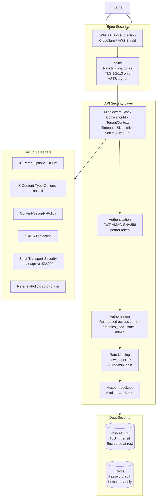
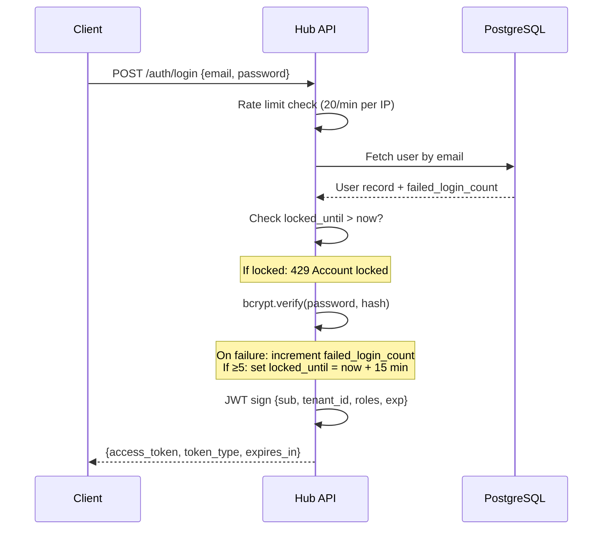
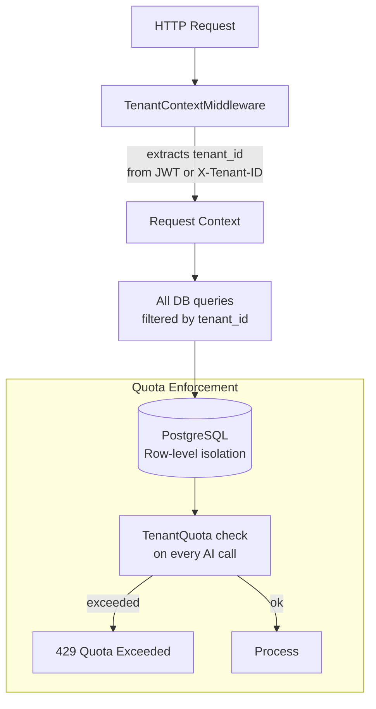
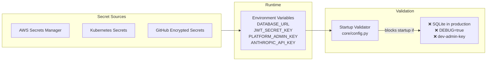

# Security Architecture — Presales Hub

## Defense-in-Depth Layers

## Authentication Flow

## Multi-Tenant Isolation

## Secrets Management

## Threat Model Summary

| Threat | Mitigation |
|--------|-----------|
| Brute force login | 20 req/min rate limit + 5-attempt lockout (15 min) |
| SQL injection | SQLAlchemy ORM parameterized queries |
| XSS | CSP headers + X-XSS-Protection |
| Clickjacking | X-Frame-Options: DENY |
| MIME sniffing | X-Content-Type-Options: nosniff |
| Oversized payloads | RequestSizeLimitMiddleware (10 MB max) |
| Slow loris / timeout abuse | RequestTimeoutMiddleware (30s default) |
| Tenant data leakage | TenantContextMiddleware + row-level filtering |
| Insecure defaults | Startup validator rejects prod with dev defaults |
| API key exposure | Secrets Manager + never committed to git |
| AI prompt injection | Grounding score filter + safety_flags evaluation |
| AI provider outages | Circuit breaker with graceful degradation |
